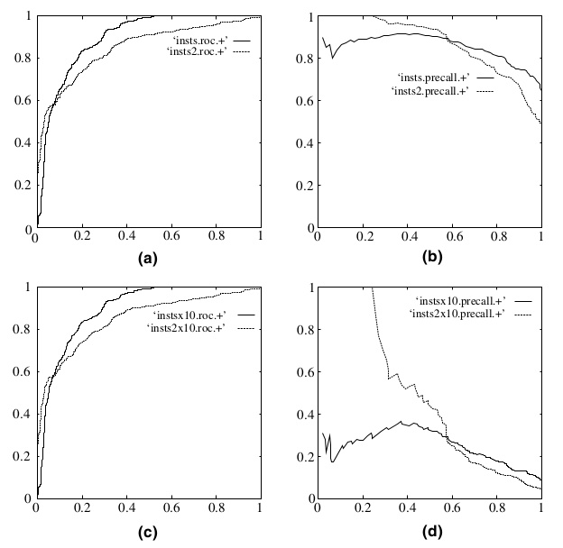
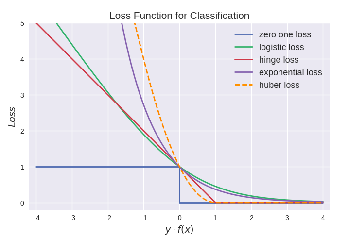
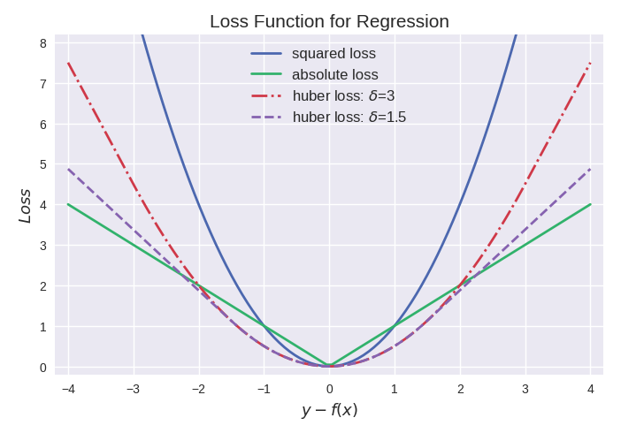
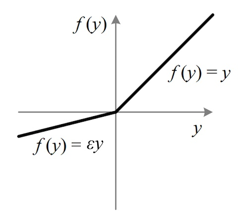
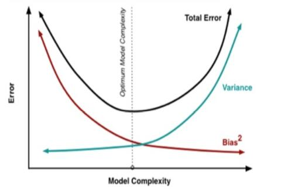
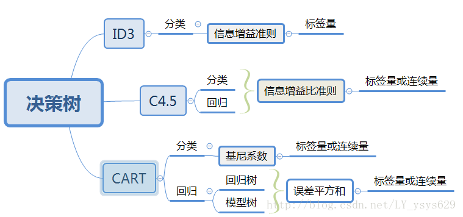

##　基础知识

### １、模型评价标准有哪些？*

(1) 均方误差：
$$
E(f;D)=\frac{1}{m}\sum_{i=1}^{m}(f(x_i)-y_i)^2
$$
(2) 精度：
$$
E(f;D)=\frac{1}{m}\sum_{i=1}^{m}\Pi(f(x_i)=y_i)
$$
(3) 查准率(Precision)与查全率/召回率(Recall)：
$$
P=\frac{TP}{TP+FP}
$$

$$
R=\frac{TP}{TP+FN}
$$

(4) F1：
$$
\frac{1}{F1}=\frac{1}{2}(\frac{1}{P}+\frac{1}{R})
$$

(5) AUC：

$m^{+}$个正样本和$m^{-}$个负样本，令$D^{+}$和$D^{-}$分别表示正负样本集合，则排序“损失”可以定义为：
$$
l_{rank}=\frac{1}{m^{+}m^{-}}\sum_{x^{+}\in D^{+}}\sum_{x^{-}\in D^{-}}(\Pi(f(x^{+})<f(x^{-}))+\frac{1}{2}\Pi(f(x^{+})=f(x^{-})))
$$

$$
AUC=1-l_{rank}
$$

AUC是ROC曲线下面的面积，衡量的是模型的排序性能，即正样本的预测值是不是更多的要大于负样本的预测值。

(6) logloss：
$$
L(Y,P(Y|X))=-log(P(Y|X))\left\{\begin{array}{cc} 
1, & x=f(Pa_{x})\\ 
0, & other\ values 
\end{array}\right.
$$
因为
$$
P(Y|X)= 
\left \{\begin{array}{cc}
f(x_i), &Y = 1\\
1-f(x_i), &Y = 0
\end{array}\right.
$$
所以最终logloss的形式表示为：
$$
L(f;D)=\sum_{i=1}^{m}[-y_ilog(f(x_i))-(1-y_i)log(1-f(x_i))]
$$

### 2、P和R怎么计算？F1怎么计算？*

见1的(3)(4)

### 3、ROC的横坐标和纵坐标分别是什么？*

TPR(正阳性率)和FPR(假阳性率)
$$
TPR=\frac{TP}{TP+FN}
$$

$$
FPR=\frac{FP}{TN+FP}
$$

前者是越大越好，后者是越小越好。

 ### 4、AUC是什么？画ROC曲线****

AUC定义见1的(5)

**画ROC曲线的技巧：从大到小设置阈值，大于该阈值的预测为正样本，小于该阈值的预测为负样本。然后根据3的公式算出TPR和FPR，描点。**

两根ROC曲线，能完全包住另一根的曲线对应的模型有更好的性能。但如果两根ROC曲线是交叉的，则得看具体应用场景，如果应用场景对假阳性率容忍度比较低则得选择特定范围内更靠左的曲线。如果没特殊要求则可以比较ROC曲线下的面积大小。

ROC曲线的优点：受类别不平衡的影响很小，而PR曲线受类别不平衡较大，见下图。

### 5、样本不均衡是否会对AUC造成影响？*

不会，auc衡量的是模型的排序性能，即把正样本排到负样本前面的性能，与正负样本比例无关。

### 6、知道哪些损失函数？*

分类损失函数(为了方便表示均列出单样本的情况)：

(1) 0-1损失函数-蓝色
$$
L(y,f(x))=\left\{\begin{array}{cc} 
1,& if\ \ yf(x)>=0\\ 
0,& if\ \ yf(x)<0 
\end{array}\right.
$$
缺点：对误分类的点一视同仁，函数不连续且非凸，不容易优化。

(2) 对数损失/交叉熵损失(cross entropy)-绿色
$$
L(y,f(x))=-ylog(f(x))-(1-y)log(1-f(x))
$$
在二分类问题中logloss和交叉熵损失是等价的。

(3) 合页损失函数(hingle loss)-红色
$$
L(y,f(x))=max(0,1-yf(x))
$$
svm的等价损失函数，hinge loss使得yf(x)>1的样本损失均为0，由此带来了稀疏解，使得svm仅通过少量的支持向量就能确定超平面。

(4) 指数损失-紫色
$$
L(y,f(x))=e^{-yf(x)}
$$
Adaboost的等价损失函数，缺点是对异常点过于敏感，鲁棒性不强。

(5) Huber损失-橘黄色
$$
L(y,f(x))=\left\{\begin{array}{cc} 
max(0,1-yf(x))^2,& if\ \ yf(x)>=-1\\ 
-4yf(x),& if\ \ yf(x)<-1 
\end{array}\right.
$$
结合了hinge loss和logistic loss的优点，既能在$yf(x)>-1$时产生稀疏解提高训练效率，又能进行概率估计。另外对于$yf(x)<-1$样本的惩罚以线性增加，意味着降低了异常点的代价，鲁棒性有所提高。

回归损失函数：

(1) 均方误差函数(MSE)
$$
L(y,f(x))=(y-f(x))^2
$$
最常用的回归损失函数，其缺点是异常点的代价比较高，鲁棒性不强；如果样本中有较多异常点，则绝对值损失表现更好一些。

(2) 绝对值损失
$$
L(y,f(x))=|y-f(x)|
$$
(3) Huber损失
$$
L(y,f(x))=\left\{\begin{array}{cc} 
\frac{1}{2}[y-f(x)]^2,& if\ \ yf(x)<=\delta\\ 
\delta|y-f(x)|-\frac{1}{2}\delta^2,& if\ \ yf(x)>\delta 
\end{array}\right.
$$
Huber损失是对二者的综合，当|y-f(x)|小于一个事先指定的值\delta时，变为平方损失，大于\delta时，则变成类似于绝对值损失，因此也是比较鲁棒的损失函数。

### 7、分类为什么用logloss？*

logloss的形式如下。在逻辑回归中，最终使用了sigmoid函数作为激活函数。把$f(x_i)=\dfrac{e^{\beta^Tx_i}}{1+\beta^Tx_i}$代入(1)式后可以得到损失函数的最终形式(2)：
$$
L(f;D)=\sum_{i=1}^{m}[-y_ilog(f(x_i))-(1-y_i)log(1-f(x_i))]\tag{1}
$$

$$
L(\beta)=\sum_{i=1}^{m}(-y_i\beta^{T}x_i+ln(1+e^{\beta^Tx_i}))\tag{2}
$$

该损失函数为凸函数，可以通过梯度下降来求得最优解。而把$f(x_i)$代入MSE损失得到的最终形式不是凸函数，此时存在损失函数多个局部极小值，影响梯度下降求全局最优解。

### 8、Logloss和AUC的区别*

1、logloss评估的是模型输出与真实值之间的偏离情况，对预测概率敏感；而auc评估的是的排序能力，对排序敏感而对预测分数不敏感；

2、logloss不仅可以作为模型的评估标准，还能作为模型的目标函数(交叉熵损失)；auc因为不可导，所以无法作为目标函数。

### 9、交叉验证的原理和作用？与直接划分训练测试集想比的优点？*

原理：

以k折交叉验证为例，把数据随机划分为k份，进行k次训练-测试。这k份样本轮流取其中一份作为测试集，另外k-1份作为该轮的训练集。取这k次结果的平均值作为最终结果。

优点：

在数据集规模较小时，划分出的测试集规模也将很小，一个小规模的测试集意味着平均测试误差估计的统计不确定性。这时候我们很难通过一次训练-测试来判断模型之间的性能差异。通过k折交叉验证可以充分利用所有数据进行训练-测试，得到的结果在统计意义上也更加的科学。

### 10、梯度下降法，牛顿法，拟牛顿法的区别？***

### 11、为什么梯度是函数变化最快的方向？*

### 12、机器学习里面常见的激活函数有哪些？为什么通常需要0均值？*

**(1) sigmoid函数**

sigmoid函数能将输出归一化到[0,1]之间，适合输出概率的情况；

缺点：

a、导数范围是[0, 0.25]，在接近函数饱和区域后网络的反向传播容易梯度消失。

b、sigmoid函数不以0为中心值，它的输出总是正数；那么关于的梯度在反向传播的过程中，将会要么全部是正数，要么全部是负数，这将会导致梯度下降权重更新时出现z字型的下降。

简单推导：
$$
f=\sum_i w_i x_i+b
$$

$$
\dfrac{df}{dw_i}=x_i
$$

$$
\dfrac{dL}{dw_i}=\dfrac{dL}{df}\dfrac{df}{dw_i}=\dfrac{dL}{df}x_i
$$

因为x_i>0，所以\dfrac{dL}{dw_i}的始终和\dfrac{dL}{df}同号。

c、计算比较耗时。

(2)tanh函数

tanh函数可以表示为：tanh(x)=2sigmoid(2x)-1，相对于sigmoid函数的缩放形式，它解决了sigmoid函数不以0为中心的缺点。但它的导数范围仍然在[0,1]之间，在深层网络的反向传播中仍然会导致梯度消失的问题。

**(3)relu函数**

relu函数的形式非常简单，计算速度也远快于前两者，可以大大加快神经网络的收敛过程。而且当输出大于0的时候relu函数的导数为常数，这个时候不会产生梯度消失的现象。

优点：

a、避免梯度消失

- `sigmoid`函数在输入取绝对值非常大的正值或负值时会出现**饱和**现象——在图像上表现为变得很平，此时函数会对输入的微小变化不敏感——从而造成梯度消失；
- `ReLU` 的导数始终是一个常数：负半区为 0，正半区为 1；所以不会发生梯度消失现象。

b、减缓过拟合

- `ReLU` 在负半区的输出为 0。一旦神经元的激活值进入负半区，那么该激活值就不会产生梯度/不会被训练，造成了网络的稀疏性——**稀疏激活**；
- 这有助于减少参数的相互依赖，缓解过拟合问题的发生。

c、加速计算

- `ReLU` 的求导不涉及浮点运算，所以速度更快

缺点：

a、但容易看出，当输出落在relu函数的左半部分则输出为0，该神经元不会参与训练过程，相当于神经元死亡”。如果学习率设置过高会造成大量的“神经元死亡”。

b、没有完全解决梯度消失的问题。

(4)leaky relu函数

leaky relu函数解决了relu函数的“神经元死亡”问题，其中$\varepsilon$是一个比较小的系数。

(5)maxout函数
$$
\max(w_1^Tx+b_1, w_2^Tx + b_2)
$$
解决了relu函数的“神经元死亡”问题，但增加了参数数量，相当于增加了一层网络。

## 机器学习算法

### 13、KNN*

### 14、KNN复杂度高怎么解决*

### 15、LR和线性回归的区别和联系*

1、在逻辑回归中，我们试图建立不同类别的概率与自变量的联系，解决的是分类问题；而线性回归则是试图建立因变量和自变量之间的线性关系，解决的是回归问题。

2、从数据上来看，线性回归的因变量是连续的，符合正态分布；而逻辑回归的因变量是离散的，符合二项分布。

3、在训练模型时，线性回归可以采用解析解(最小二乘法)也可以采用梯度下降；而逻辑回归并不存在解析解，只能通过梯度下降训练模型。但这两种方法的本质都是极大似然估计。

### 16、LR推导\*\*\*\*\*\*\*\*\*\*\*\*

​        LR模型是由极大似然法推导得出的分类模型。对于一个线性模型，我们一般用y=w^T+b来表示。当一个样本点落在LR超平面上时有P(y=1|x)=P(Y=0|x)=1-P(y=1|x)，即ln\dfrac{P(y=1|x)}{1-P(y=1|x)}=0=w^T+b。整理可得：
$$
P(y=1|x)=\dfrac{e^{w^Tx+b}}{1+e^{w^Tx+b}}=\dfrac{1}{1+e^{-(w^Tx+b)}}\tag{1}
$$
这便是LR模型的函数表示，也是sigmoid函数的原型。

​	对于一个二分类问题，我们假设P(y=1|x)=f(x)为模型的函数表示，代表分类结果为1的概率；那么P(Y=0|x)=1-f(x)则表示分类结果为0的概率。根据极大似然法可以写出总的样本分布概率式子：
$$
\begin{eqnarray}
P(Y|X)&=&\prod_{i}P(y_i|x_i)^{y_i}(1-P(y_i|x_i))^{1-y_i}\\
&=&\prod_if(x_i)^{y_i}(1-f(x_i))^{1-y_i}
\end{eqnarray}
$$
对式子两边同时取对数可得：
$$
logP(Y|X)=\sum_i[y_ilogf(x_i)+(1-y_i)log(1-f(x_i))]\tag{2}
$$
为了方便推导，把累加号省略，把(1)式代入(2)可以得到：
$$
\begin{eqnarray}
L(w)&=&[ylogf(x)+(1-y)log(1-f(x))]\\
&=&[ylog\dfrac{e^{w^Tx+b}}{1+e^{w^Tx+b}}+(1-y)log\dfrac{1}{1+e^{w^Tx+b}}]\\
&=&[yloge^{w^Tx+b}-ylog(1+e^{w^Tx+b})-(1-y)log(1+e^{w^Tx+b})]\\
&=&y(w^Tx+b)-log(1+e^{w^Tx+b})
\end{eqnarray}
$$
因为极大似然函数需要求最大值，所以损失函数需要在前面加上负号，故LR模型的最终目标函数为：
$$
L(w)=\frac{1}{m}\sum_{i=1}^{m}[log(1+e^{w^Tx+b})-y(w^Tx+b)]
$$
LR模型的优化过程：

首先写一下sigmoid函数的性质：
$$
g(z)=\dfrac{1}{1+e^{-z}}\\
\dfrac{\partial g}{\partial z}=g(z)(1-g(z))
$$
显然有f(x)=g(w^Tx+b)由上面的推导可以知道LR模型的损失函数为：
$$
L(y,f)=ylogf(x)+(1-y)log(1-f(x))
$$
对w进行求导可得：
$$
\dfrac{\partial L}{\partial w}=\dfrac{\partial L}{\partial f}\dfrac{\partial f}{\partial z}\dfrac{\partial z}{\partial w}=\dfrac{y}{f(x)}\cdot f(x)(1-f(x))\cdot x^T+(1-y)\cdot \dfrac{1}{1-f(x)}\cdot(-f(x)(1-f(x)))\cdot x^T
$$
整理可得：
$$
\dfrac{\partial L}{\partial w}=(y^{'}-y)\cdot x^T
$$
其中$y^{'}$是真实标记，$y$是函数的输出值。

根据梯度下降的迭代公式有：
$$
w=w-\dfrac{\partial L}{\partial w}=w-(y^{'}-y)\cdot x^T
$$
这便是LR模型的优化过程。

### 17、LR如何解决共线性问题，为什么深度学习不强调？*

解决方法：

(1) 增加训练样本数量；

(2) 主成分分析PCA，提取主要的特征；

(3) 加入L1, L2正则化项；

(4) 逐步回归法：特征逐步加入回归模型，用已选入的特征进行F检验，如果原有的变量因为后引入的变量而变得不显著，就将其删除。

深度学习模型复杂度高，而且有很多正则化的trick，像L1,L2正则化，dropout，batch normalization等等；本身就具有选择特征、抽象深层特征的能力，所以可以解决共线性问题。

### 18、LR为什么使用sigmoid函数？*

### 19、LR的缺点*

(1)对共线性比较敏感，如果相关属性较多，将会削弱独立属性，造成模型有偏。需要利用因子分析或者变量聚类分析等手段来选择代表性的特征，以减少自变量之间的相关性；

(2)预测结果呈现S型，两端概率变化小，中间概率变化大比较敏感，导致很多区间的变量的变化对目标概率的影响没有区分度，无法确定阈值。

(3)模型比较简单，容易欠拟合，不能处理缺失特征等。

### 20、LR损失函数***

交叉熵损失的形式：
$$
L(f;D)=\sum_{i=1}^{m}[-y_ilog(f(x_i))-(1-y_i)log(1-f(x_i))]\tag{1}
$$
LR模型的函数形式：
$$
f(y=1|x)=\dfrac{e^{-(w^Tx+b)}}{1+e^{-(w^Tx+b)}}\tag{2}
$$
把(2)代入(1)可以得到：
$$
\begin{eqnarray}
L(f;D)&=&\sum[-ylog(\dfrac{e^{-(w^Tx+b)}}{1+e^{-(w^Tx+b)}})-(1-y)log(\dfrac{1}{1+e^{-(w^Tx+b)}})]\\
&=&\sum[-ylog(e^{-(w^Tx+b)})+ylog(1+e^{-(w^Tx+b)})+log(1+e^{-(w^Tx+b)})-ylog(1+e^{-(w^Tx+b)})]\\
&=&\sum-ye^{-(w^Tx+b)}+log(1+e^{-(w^Tx+b)})
\end{eqnarray}
$$
这便是LR模型损失函数的最终形式。

### 21、LR和最大熵模型的相同点和不同点*

### 22、如果所有样本都是正样本，那么训练出的LR模型的超平面是什么样的？*

所有样本点都在超平面的一侧。

### 23、讲一下softmax，需要推导***

### 24、推导softmax的梯度，和tanh的梯度(求导)*

### 25、softmax的损失函数*

同样是交叉熵函数的形式，只不过从LR的二元变成了多元：
$$
L=-\sum_{j=1}^{T}y_jlog(s_j)=-\frac{1}{m}\sum_{i=1}^{m}\sum_{j=1}^{k}y_i^jlog\dfrac{e^{\theta_j^Tx_i}}{\sum_{l=1}^ke^{\theta_l^Tx_i}}
$$

### 26、解释一下交叉熵**

### 27、交叉熵函数的形式*

$$
-\frac{1}{m}\sum_{j=1}^{m}\sum_{i=1}^{k}t_{ji}logP_{ji}
$$

$$
-\frac{1}{m}\frac{1}{k}\sum_{j=1}^{m}\sum_{i=1}^k[t_{ji}logP_{ji}+(1-t_{ji})log(1-P_{ji})]
$$

$$
-\frac{1}{m}\sum_{j=1}^m[t_jlogP_j+(1-t_j)log(1-P_j)]
$$

(1) 式子1，用于那些类别之间互斥(如：一张图片中只能保护猫或者狗的其中一个)的单任务分类中。连接的 softmax层之后的概率分布。

(2) 式子2，用于那些类别之间不存在互斥关系(如:一张图片中可有猫和狗两种以上的类别同时存在)的多任务学习分类中。最后一层的每个节点不在是softmax函数的输出了，而是sigmoid。把每个节点当成一个完整的分布，而式子1是所有节点组合程一个完整分布。

(3) 式子3，用于最后一层只有一个节点的二分类任务。

### 28、为什么用交叉熵损失函数而不用均方误差函数？**

### 29、在哪些场景下的分类问题不适用交叉熵损失函数？*

对于交叉熵损失函数的原始形式：
$$
-\frac{1}{m}\sum_{j=1}^{m}\sum_{i=1}^{k}t_{ji}logP_{ji}\tag{1}
$$
(1)式默认每个样本有且只有一个分类标记，因此只适用于单标记分类问题，也就是神经网络最后一层是softmax的情况。对于多标记分类问题，不能直接使用交叉熵损失函数的原始形式。需要变换成如下形式：
$$
-\frac{1}{m}\sum_{j=1}^{m}\sum_{i=1}^k[t_{ji}logP_{ji}+(1-t_{ji})log(1-P_{ji})]
$$

### 30、最大似然和交叉熵**

### 31、极大似然函数和极大后验函数是啥？*

### 32、回归问题的损失函数都有哪些？从哪些角度设计一个合理的损失函数？*

损失函数参见问题6。

设计损失函数的考虑：

(1) 模型在实际场景中的侧重点。比如重查准率还是查全率，像辅助诊断癌症的模型就要求有高查全率，漏查是需要极力避免的情况。通过这个我们可以设计比较合理的正负样例权重。

(2) 函数的数学性质：

a、是否可导

一般情况下模型的优化都需要用到梯度下降，所以可求导是一个损失函数必备的条件。对于XGBoost这种用到二阶导数信息的模型来说，要求函数二阶可导。 

b、是否为凸函数

这一点不是必须的，但如果目标函数是凸函数将有助于求得全局最优解。像LR模型的目标函数关于w为凸函数，但如果损失函数换成均方误差，则模型非凸。

### 33、LR怎么实现多分类？*

(1) one vs rest： 每个类别单独训练一个分类器；

(2) 修改损失函数，扩展为softmax回归；

### 34、SVM推导*\*\*\*\*\*\*\*\*\*\*\*

### 35、SVM的损失函数*\*\*\*

 合页损失函数(hingle loss)：
$$
L(y,f(x))=max(0,1-yf(x))
$$
svm的等价损失函数，hinge loss使得yf(x)>1的样本损失均为0，由此带来了稀疏解，使得svm仅通过少量的支持向量就能确定超平面。

### 36、SVM核函数，对核函数有什么要求？本质是什么？*\*\*\*\*

要求对应的矩阵是半正定的。本质是低维特征空间到高维特征空间的一种映射关系。

### 37、SVM如何选择核函数？*\*\*

特征维数d超过样本数m时，选择线性核；

特征维数d较小样本数m中等时，选择RBF核；

样本数特别大时，不宜选择SVM模型。

### 38、SVM如何进行多分类，为什么一般不这么做？*\*

### 39、SVM能否通过梯度下降来求解？*

优化问题等价成hinge loss目标函数后就可以用梯度下降求解。

### 40、LR和SVM的区别*\*\*\*\*\*\*\*\*\*\*\*\*

知乎链接：
https://www.zhihu.com/question/26768865/answer/34048357

1、目标函数不同：LR目标函数为交叉熵损失，SVM目标函数为hinge loss；

2、Linear SVM不直接依赖数据分布，分类平面不受一类点影响；LR则受所有数据点的影响。如果存在类别不平衡问题，LR模型需要先对数据做平衡处理。

3、在解决非线性问题时，SVM通常会使用核函数。但LR一般不会，因为所有样本点均会参与核计算复杂度过高。

4、Linear SVM依赖数据表达的距离测度，所以需要对数据先做normalization；LR不受其影响。

4、SVM模型自带正则化项，而LR没有。

### 41、在数据量比较大的情况下LR和SVM哪个效果更好？*

LR模型

1、Linear SVM的最终优化问题为：
$$
min_{\alpha}\frac{1}{2}\sum_{i=1}^{m}\sum_{j=1}^{m}\alpha_i \alpha_jy_iy_j\boldsymbol{x_i}^T\boldsymbol{x_j}-\sum_{i=1}^m\alpha_i\\
s.t\ \sum_{i=1}^m\alpha_iy_i=0
$$
可以看出该表达式的复杂度为$O(m^2)$，比梯度下降的复杂度要高。

2、SVM参数只取决于部分支持向量，增加数据量并不一定能提高模型的性能。而LR模型参数受所有样本点影响，增大数据量对提高模型精度是有帮助的。

3、如果用到核技巧，SVM需要存储一个kernel matrix，大小为m*m。对于海量数据来说，这个矩阵会很大，内存消耗严重。

### 42、SVM为什么要转化成对偶形式？\*\*\*\*\*\*

1、原始问题的拉格朗日形式为：
$$
min_{w,b}max_{\alpha}[\frac{1}{2}w^Tw+\sum_{i=1}^m\alpha_i(1-y_i(w^Tx_i+b))]
$$
w在外面一层，不能直接对其求导，所以需要转换成max_{\alpha ,\beta}min_w的形式。

2、对偶形式把优化问题转换成样本点内积的形式，方便引入核函数。

3、原本的优化问题复杂度和样本点维度,样本数量相关，当样本点的维度过高则容易引起维度灾难。转换成对偶问题并引入核函数后，复杂度就只和样本数量有关。

### 43、KKT条件具体是什么？*

1、主问题可行：1-y_i(w^Tx_i+b)\leq 0

2、对偶问题可行：\alpha \geq 0

3、互补松弛条件：\alpha_i(1-y_i(w^Tx_i+b))=0

### 44、对VC维的理解*

### 45、生成式模型和判别式模型的区别，分别有哪些？**

### 46、降维有哪些方法？*

### 47、PCA原理，和LDA的区别*\*\*

### 48、LDA的推导*

### 49、SVD*\*

### 50、SVD和特征值的关系*

### 51、朴素贝叶斯的原理，“朴素”应该怎样理解？*\*\*\*

### 52、HMM和CRF*\*\*\*\*\*\*

### 53、GMM算法*\*\*

### 54、讲下EM算法，核心是什么？E步和M步的具体步骤？E中的期望是什么？*\*\*

## 过拟合与正则化

### 55、训练误差和验证误差的关系*

### 56、过拟合和欠拟合*\*\*

### 57、如何判断过拟合**

观察训练误差和测试误差曲线走向

### 58、防止过拟合的方法*\*\*\*\*\*\*\*\*\*\*\*

1、选择复杂度低的模型，比如LR，Linear SVM；

2、L1、L2正则化；

3、决策树剪枝；

3、bagging；

4、dropout；

5、data augmentation；

6、early stop；

7、batch normalization；

### 59、讲讲机器学习中的方差和偏差，对于训练的意义？*\*\*\*

机器学习中模型的误差可以分解为两部分，bias和variance。一般情况下，模型需要在bias和variance之间取得一个平衡。bias小的模型，variance一般大；variance小的模型，bias一般大。

**Error due to Bias：** Bias表示的是模型预测的值和真实值之间的距离的期望，代表算法的拟合能力。

**Error due to Variance：**Variance表示的是当年对一个模型用不同的数据进行多次建模时，这些模型在某一个点上的预测值的方差就是该模型在这个点上预测值的variance，其实就是预测值的方差。Variance代表算法的鲁棒性。

假设我们的真实标记y，测试集标记为y_D，变量是x，我们的模型用f表示，则有y=y_D+\epsilon，那么误差可以表示为：
$$
Err(x)=E[(f(x)-y_D)^2]
$$
Bias可以表示为：
$$
Bias^2=E[(y-f(x))^2]
$$
$Variance$可以表示为：
$$
Variance=E[(E[f(x)]-f(x))^2]
$$
噪声$\epsilon$可以表示为：
$$
\epsilon^2=(y-y_D)^2
$$
上述误差可以分解为如下部分：
$$
\begin{eqnarray}
Err(x)&=&E[(y_D-f(x))^2]\\
&=&E[(y_D-E[f(x)]+E[f(x)]-f(x))^2]\\
&=&E[(y_D-E[f(x)])^2+(E[f(x)]-f(x))^2+2(y_D-E[f(x)])(E[f(x)]-f(x))]\\
&=&E[(y_D-E[f(x)])^2]+E[(E[f(x)]-f(x))^2]\\
&=&E[(y_D-y+y-E[f(x)])^2]+E[(E[f(x)]-f(x))^2]\\
&=&E[(y_D-y)^2+(y-E[f(x)])^2+2(y_D-y)(y-E[f(x)])]+E[(E[f(x)]-f(x))^2]\\
&=&E[(y_D-y)^2]+E[(y-E[f(x)])^2]+E[(E[f(x)]-f(x))^2]\\
&=&\epsilon^2+Bias^2+Variance
\end{eqnarray}
$$

### 60、讲讲bagging和boosting各自对于偏差方差的侧重点*

bagging增加bias降低variance

boosting增加variance降低bias

### 61、方差偏差分解的公式*

见59推导

### 62、正则化有哪些方法？***

1、参数范数惩罚：L1、L2正则化；

2、数据集增强；

3、往输入，输出加入噪声；

4、early stop；

5、参数绑定和参数共享：CNN；

6、dropout；

7、对抗训练；

8、bagging和其他集成方法；

### 63、正则化和偏差误差的关系？*

### 64、介绍L1、L2正则化及其区别，应用场景*\*\*\*\*\*\*\*\*\*\*

- **相同点**：限制模型的学习能力——通过限制参数的规模，使模型偏好于**权值较小**的目标函数，防止过拟合。
- **不同点**：
  - **L1 正则化**可以产生更**稀疏**的权值矩阵，可以用于特征选择，同时一定程度上防止过拟合；**L2 正则化**主要用于防止模型过合
  - **L1 正则化**适用于特征之间有关联的情况；**L2 正则化**适用于特征之间没有关联的情况。

### 65、L1正则化有什么好处？*

见64

###　66、从数学角度上解释为什么L2正则化能提高模型的泛化能力*

L2正则化表达形式一般如下：
$$
L(w)=J(w)+\frac{\alpha}{2}||w||^2
$$
L(w)是最终的目标函数，\dfrac{\alpha}{2}||w||^2为L2正则化项。
$$
w:=w-\frac{\partial L}{\partial w}=(1-\alpha)w-\dfrac{\partial J}{\partial w}
$$
可以看出在梯度下降的过程中，w都会乘以一个小于1的系数(1-\alpha)，也就是说L2正则化会使模型偏好于更小的权重。更小的权重意味着降低了模型复杂度，从而提高了模型的泛化能力。(**奥卡姆剃刀原理**)

### 67、L1正则化如何求梯度？*

L1正则化表达形式一般如下：
$$
\Omega(w)=\beta||w||
$$
导数是分段函数，在0处令其导数为0：
$$
\dfrac{\partial \Omega}{\partial w}=\left\{\begin{array}{cc} 
1& if\ \ w>0\\ 
0& if\ \ w=0\\
-1& if\ \ w<0\\
\end{array}\right.
$$

### 68、用梯度解释为什么L1正则化有稀疏作用？*

## 聚类

### 69、KMeans原理和训练过程*\*\*\*

### 70、KMeans如何选择k的个数？*

### 71、KMeans的时间复杂度和空间复杂度*

### 72、距离的计算方法，向量之间？字符串之间？**

### 73、DBSCAN的原理和算法伪码，与KMeans,OPTICS的区别**

## 决策树模型与集成学习

### 74、决策树原理，剪枝和评价指标*

- #### 信息增益

  “信息熵”是度量样本集合纯度最常用的一种指标。假定当前样本集合$D$中第$k$类的样本比例为$pk(k=1,2,...,m)$，则$D$的信息熵定义为：
  $$
  Ent(D)=-\sum_{k=1}^mp_k\log_2p_k
  $$
  这个值越小，数据集的纯度越高。

  假设我们利用属性a有两种取值，可以把D划分为两个集合D_1和D_2，那么划分之后它们的信息熵就变成Ent(D_1)和Ent(D_2)。这个划分的信息增益可以定义为：
  $$
  Gain(D,a)=Ent(D)-\sum_{i=1}^2\frac{|D_i|}{|D|}Ent(D_i)
  $$

- #### 信息增益比

  **信息增益对可取值数目较多的属性有所偏好，为了减少这种偏好带来的不利影响，有时会采用信息增益比作为划分节点的标准。**

  信息增益比定义为：
  $$
  GainRatio(D,a)=\dfrac{Gain(D,a)}{IV(a)}\\
  IV(a)=-\sum_{i=1}^{V}\dfrac{|D_i|}{|D|}log_2\dfrac{|D_i|}{|D|}
  $$
  对于取值多的属性IV(a)也越大。

  **ID3决策树使用信息增益来选择划分属性，而C4.5则是使用信息增益率，这是它们的主要区别。**

- #### 基尼系数

  采用和信息增益一样的符号，基尼系数的定义如下：
  $$
  Gini(D)=\sum_{k=1}^mp_k(1-p_k)=1-\sum_{i=1}^mp_k^2
  $$
  基尼系数越小代表数据集的纯度越高。

  属性a的基尼系数定义为：
  $$
  GiniIndex(D,a)=\sum_{i=1}^V\dfrac{|D_i|}{|D|}Gini(D_i)
  $$
  CART决策树每轮从候选属性中选择能让基尼系数最小的属性作为最优划分属性，即：
  $$
  a=arg_{a\in A}\min GiniIndex(D,a)
  $$

### 75、决策树种类以及分类方式(ID3、C4.5、CART)？**

### 76、CART回归树是怎么实现的**

### 77、CART分类树和ID3以及C4.5有什么区别**

###　78、树模型如何处理缺失值和连续值？*

### 79、如果有1W个地理坐标，转换成1到10000的数，可以用决策树么？*

### 80、决策树分类和决策树回归有什么区别？*

### 81、决策树如何选择划分节点？**

### 82、决策树做回归的时候划分节点怎么做选择？*

### 83、为什么有了信息增益还提出信息增益比？*

### 84、信息增益、信息增益比、基尼系数的公式和原理**

### 85、决策树对数据的划分进行了更细的粒度，这样容易造成数据的过拟合，有什么解决办法？*

### 86、剪枝有哪几种方式？*

### 87、随机森林原理，它和决策树的关系*\*\*\*\*\*\*

### 88、随机森林特征分裂的依据*

### 89、随机森林的参数*

### 90、随机森林是如何选择特征的？如何评价特征重要性？***

### 91、随机森林如何防止过拟合，随机性体现在哪？**

### 92、随机森林和GBDT的区别*

### 93、随机森林和GBDT的基分类器区别，如何剪枝*

### 94、随机森林，adaboost和GBDT的联系和区别*

### 95、Adaboost的学习策略*

### 96、Adaboost是如何更新样本权重的？**

### 97、Adaboost和GBDT的区别**

### 98、随机森林的树会不会限制它的生长？GBDT呢？为什么？*

### 99、GBDT的原理以及常用的参数*\*\*\*\*\*

### 100、GBDT分类模型拟合的是什么？*

### 101、GBDT如何做分类和回归？*

### 102、GBRT的原理，推导以及适用场景*\*\*\*\*\*\*\*

### 103、GBDT与随机森林的区别在哪，分别用在什么地方？***

### 104、GBDT为什么用梯度来优化，有什么好处？*

### 105、正负样本比例对LR和GBDT的影响？*

### 106、XGBoost和LR相比的优缺点？*

### 107、XGBoost和GBDT比有哪些区别、优点？*\*\*\*\*\*\*\*\*\*\*

### 108、XGBoost的优化方法和GBDT的优化方法有什么区别？*

### 109、XGBoost和随机森林的区别和各自的优点？***

### 110、XGBoost详细原理推导*\*\*\*\**\*\*

### 111、XGBoost的VC维是多少？决策树呢？**

### 112、XGBoost如何防止过拟合*

1、限制树生长的深度，叶子数量和树的棵数；

2、行采样和列采样；

3、在目标函数中加入了和衡量树复杂度的正则化项，l1和l2；

4、验证集检验与early stop；

### 113、XGBoost为什么用二阶泰勒展开？*\*\*\*

### 114、XGBoost中L1正则化是怎么用的？*

### 115、XGBoost的行抽样，列抽样可以起到哪些作用？样本少了不是容易过拟合么，为什么还能防止过拟合？**

### 116、XGBoost，LR和SVM中哪个处理数据不平衡问题的能力最强？*

### 117、Lightgbm的原理和特性***

### 118、XGBoost，Lightgbm，GBDT的区别和适用场景？*\*\*\*\*\*\*\*

### 119、XGB和LGB并行如何实现**

### 120、集成学习介绍(boosting，bagging，stacking)，bagging和boosting的差异*\*\*\*\*\*\*\*\*\*

### 121、Bagging为什么能减小方差？*

### 122、stacking和blending的区别*

## 其他

### 123、模型融合有哪些方式，区别以及适用场景？*

### 124、tfidf的原理是什么，请写出计算公式*\*\*\*

### 125、强化学习和监督学习的区别？*

### 126、DQN的基本原理*

### 127、DQN模型为什么要做经验回收*

### 128、Dueling DQN和DQN有什么区别？*

