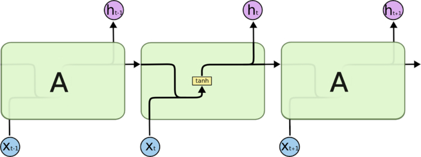
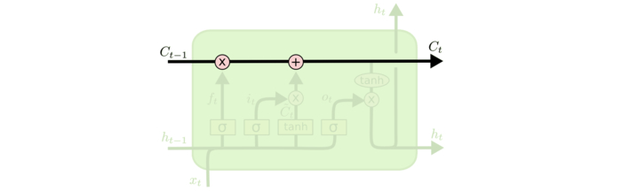

[TOC]

## Clean text

## 关键字提取

## 文本相似度计算

## 主题模型

## Data augmentation

### smote
一种过采样的方法，简单说就是选择少数类别的某个样本点和近邻一个其他样本点，取它们连线上某一点作为新的样本点。

### knn word swap
k近邻样本替换，这是基于word embedding来做的，word embedding把单词转换成向量形式，这些向量具有语义性。因此欧氏距离相近的两个词向量表示两个单词具有相似的语义。所以在句子中可以用knn得到某个单词的k个近邻单词，并替换得到新的样本。

## TFIDF
$$
\text{TF-IDF}(t,d)=\text{TF}(t,d)*\text{IDF(t)}
$$
$\text{TF}(t,d)$为单词t在文档d中出现的频率，$\text{IDF(t)}$是逆文档频率，用来衡量单词t对表达语义所起的重要性，表示为：
$$
\text{IDF(t)}=log\dfrac{文章总数}{包含单词t的文章总数+1}
$$
## Word2vec

## Glove

## Fasttext

## TextCNN

## RNN

基础的神经网络只在层与层之间建立了权连接，RNN最大的不同之处就是在层之间的神经元之间也建立的权连接。

存在的问题：

反向传播需要导数累乘，sigmoid的倒数范围是0~0.25，进而会导致梯度消失。解决梯度消失的办法有：

1、选取更好的激活函数；

2、改变传播结构；

关于第一点可以用tanh或者relu函数。tanh导数范围是0~1，可以稍微改善梯度消失现象但仍然避免不了；relu的话当输出值在左边时会导致“神经元死亡”。关于第二点的话可以用LSTM。

## LSTM

LSTM有三个门，从左到右分别是遗忘门、输入门、输出门。

更新公式：

## GRU

更新公式：

## Sequence-to-Sequence

## EM算法

## CRF

## Attention机制

## Transformer

## BERT

