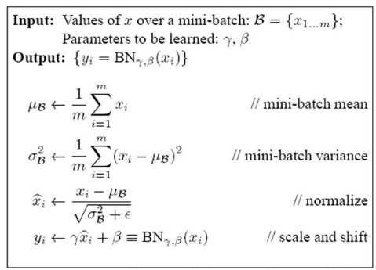

### 神经网络反向传播机制\*\*\*

### 梯度消失和梯度爆炸的产生和原因，如何改善？\*\*\*\*\*

### 交叉熵损失不适应什么场景？

### 深度学习中有哪些优化方法？

### CNN卷积和池化的作用？\*\*\*\*

### CNN反卷积的原理和作用？

### 1*1卷积的作用？

如果卷积的输出输入都只是一个平面，那么1x1卷积核并没有什么意义，它是完全不考虑像素与周边其他像素关系。 但卷积的输出输入是长方体，所以1x1卷积实际上是对每个像素点，在不同的channels上进行线性组合，且保留了图片的原有平面结构，调控depth，从而完成升维或降维的功能。

如下图所示，如果选择2个filters的1x1卷积层，那么数据就从原本的depth 3 降到了2。若用4个filters，则起到了升维的作用。

### RNN的结构和梯度消失问题\*\*\*\*

### LSTM的结构+原理 \*\*\*\*\*\*\*\*\*\*

### LSTM为什么它能解决RNN的梯度消失问题？\*\*\*

### GRU的结构+原理

### 深度学习中有哪些防止过拟合的方法

1、增加训练样本，数据增强(data augmentation)

2、L1，L2正则化；

3、earlystop；

4、dropout；

### dropout的原理和作用，为什么它能防止过拟合\*\*\*\*\*\*

- 原理

1、训练过程：在神经网络中某一层赋予神经元一个丢失率，比如10%，那么在训练过程中每次前向传播时都会随机将10%的神经元的输出置为0；然后在没有置0的神经元上更新参数。

2、测试过程：该层的神经元输出都要乘以90%，这样相当于训练了很多个神经网络，最后取模型输出的平均，类似于bagging。

- 为什么可以防止过拟合？

(1) 从原理来看，dropout相当于bagging，相当于训练了很多个神经网络，最后取模型输出的平均，类似于bagging。

(2) 有些特征只有和其他特定特征结合才有效果，dropout削弱了这种共同作用，可以让神经网络学习到更加鲁棒的特征。

### BN的原理和作用\*\*\*\*\*\*\*\*

- 原理

对于每个隐层神经元，把逐渐向极限饱和区靠拢的输入分布转换成均值为0方差为1的比较标准的正态分布，使得非线性变换函数的输入值落入对输入比较敏感的区域，以此**改善梯度消失问题，可以加速训练的收敛过程**。

对于Mini-SGD来说，一次训练过程里面包含m个训练样本，具体的BN操作就是对隐藏层的每个神经元激活值做如下变换：
$$
\hat{x}^{(k)}=\dfrac{x^{(k)}-E[x^{(k)}]}{\sqrt{Var[x^{(k)}]}}
$$
但是这样会**导致网络表达能力下降**，为了防止这一点，每个神经元增加两个调节参数（scale和shift），这两个参数是通过训练来学习到的，用来对变换后的激活反变换，使得网络表达能力增强，即对变换后的激活进行如下的scale和shift操作，这其实是变换的反操作：
$$
y^{(k)}=\gamma^{(k)}\hat{x}^{(k)}+\beta^{(k)}
$$
BN整体的伪代码如下：

- 作用

  (1) 加快了模型收敛的速度；

  (2) BN过程打破了原有隐藏层的数据分布，相当于给模型增加了噪声，有一定的防止过拟合的作用；

  (3) 对模型初始化要求变低了；

### 介绍word2vec的原理，CBOW和Skip-gram*\*\*\*\*\*\*\*\*\*

### 介绍fasttext和glove的原理\*\*\*\*

