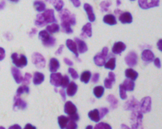

## 简介

检测在不同条件下的细胞核，并通过算法将其分割出来。下图是训练样本之一，选手需要构建模型得到细胞核的mask，然后用rle编码提交检测结果。

## 场景分析

(1) 因为需要生成mask，所以需要用到pix2pix模型。

(2) 医学图像边界模糊、梯度复杂，需要较多的高分辨率信息。高分辨率用于精准分割。

(3) 图像只有细胞和一些比较简单的环境，语义简单明确，低分辨率信息能够提供这一信息，用于目标物体的识别。

UNet结合了**低分辨率信息**（提供物体类别识别依据）和**高分辨率信息**（提供精准分割定位依据），完美适用于医学图像分割。

另外，mask-rcnn在图像分割方面也是性能最好的模型之一 (截至比赛结束之日)。所以初步决定用这两个模型进行实验。

## 图像预处理

1、数据增强

(1) 因为细胞图像没有上下朝向的问题，所以原图像做90，180，270度的旋转，上下，左右翻转，就已经能够得到6倍于原数据集的样本；

(2) 小幅度做左右上下平移和旋转又能够把样本扩充到原来很多倍；

2、把颜色不同的样本分开训练

kaggle平台一共提供了670张样本，存在两种颜色的图像：一种是黑白，而另一种是紫色的，如下图所示。按照直觉判断，这两种样本差异较大，放一起训练可能会影响模型的效果。实验结果也表明这种推断。**紫色图像有128张，我们的做法是把这两种样本分开，训练两个针对性的模型。当然，测试样本也需要把紫色图像单独挑出来，分开预测。这个操作最终提高了接近0.1的分数。**

