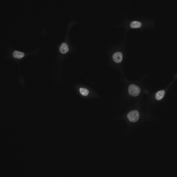

## 简介

检测在不同条件下的细胞核，并通过算法将其分割出来。下图是训练样本之一，选手需要构建模型得到细胞核的mask，然后用rle编码提交检测结果。

## 场景分析

(1) 因为需要生成mask，所以需要用到pix2pix模型。

(2) 医学图像边界模糊、梯度复杂，需要较多的高分辨率信息。高分辨率用于精准分割。

(3) 图像只有细胞和一些比较简单的环境，语义简单明确，低分辨率信息能够提供这一信息，用于目标物体的识别。

UNet结合了**低分辨率信息**（提供物体类别识别依据）和**高分辨率信息**（提供精准分割定位依据），完美适用于医学图像分割。

另外，mask-rcnn在图像分割方面也是性能非常突出的模型。所以初步决定用这两个模型进行实验。

